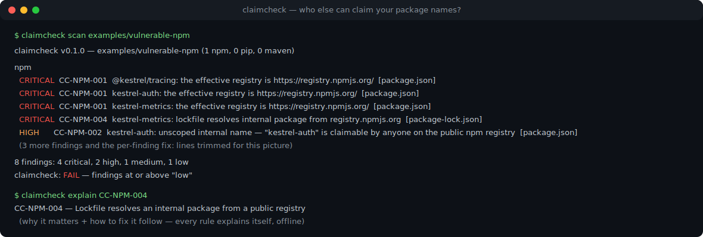
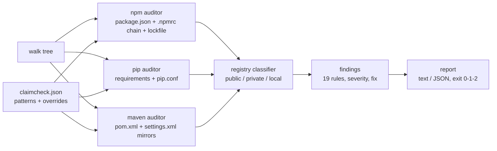

# claimcheck

[English](README.md) | [中文](README.zh.md) | [日本語](README.ja.md)

[](LICENSE)   [](CONTRIBUTING.md)

**npm・pip・Maven の設定に潜む依存関係かく乱（dependency confusion）の露出——スコープなしの内部パッケージ、欠落したレジストリマッピング——を静的に監査。完全オフライン、プロービング不要。**



```bash
# not yet on npm — install from a checkout of this repository
npm install && npm run build && npm pack
npm install -g ./claimcheck-0.1.0.tgz
```

## なぜ claimcheck？

Alex Birsan の「Dependency Confusion」が 6 桁のバグバウンティを稼いでから 5 年、この攻撃はいまだに通用します。根本原因が脆弱性ではなく*設定のデフォルト*だったからです：リゾルバはあなたのプライベートレジストリにしか存在しない名前を平気でパブリックレジストリに問い合わせ、その公開名を登録した者がコードを供給できてしまう。既存ツールは外側から攻めます：プローブ型ツールはパブリックレジストリに登録・照会して内部名が取得可能かを確かめますが、ネットワークアクセスと内部名リストが前提で、しかも*なぜ*露出したのかは何も教えてくれません。脆弱性スキャナは既知の悪いバージョンを探すだけで、攻撃者のバージョンを受け入れてしまうリゾルバは見ません。claimcheck は内側から攻めます：すでにリポジトリにコミットされているファイル——`package.json` + `.npmrc` チェーン + lockfile、`requirements*.txt` + `pip.conf`、`pom.xml` + `settings.xml`——を読み、各リゾルバの実際のルーティング判断（npm のスコープマッピング優先順位、pip のインデックス統合、Maven のミラー照合）を再現し、解決パスが「誰でも名前を取得できる」レジストリに届く内部パッケージをすべて名指しします。19 のルール、ファイル単位の正確な引用、発見ごとの修正案、CI 向けの終了コード 1——そしてネットワークには 1 バイトも流しません。

|  | claimcheck | confused (Visma) | dependency-combobulator | SCA スキャナ / 更新ボット |
|---|---|---|---|---|
| 完全オフラインで動作 | はい——設定を読むだけ、プローブしない | いいえ——パブリックレジストリへ照会 | いいえ——パブリックレジストリへ照会 | いいえ——ホスト型 / レジストリ API |
| 露出の原因となる*設定そのもの*を特定 | はい、ファイルと行を引用 | いいえ——名前が空いている事実のみ | いいえ——パッケージ単位のシグナルのみ | いいえ |
| リゾルバのルーティングを監査（.npmrc / pip.conf / settings.xml） | はい、3 つすべて | いいえ | いいえ | いいえ |
| lockfile に残る過去のパブリック解決の証拠 | はい（CC-NPM-004） | いいえ | いいえ | いいえ |
| npm + pip + Maven を 1 ツールでカバー | はい | はい（プローブのみ） | 部分的、プラガブル | 製品による |
| 発見ごとの修正ガイド | はい、ルールごとに `explain` | いいえ | いいえ | 汎用的 |
| ランタイム依存 | 0 | Go modules | Python 依存 | ホスト型サービス |

<sub>各ツールの公開リポジトリ/ドキュメントに基づき 2026-07 に確認。プローブ型ツールと claimcheck は補完関係です：前者は名前が取得可能なことを示し、claimcheck はどのコミット済み設定が取得された名前を招き入れるかを示します。</sub>

## 特徴

- **リゾルバ自身のロジックを静的に再生**——npm の最寄り `.npmrc` 優先チェーンとスコープ優先順位、pip のインデックス統合（まさに Birsan の `--extra-index-url` 攻撃ベクトル）、Maven の `DefaultMirrorSelector`（`*`、`external:*`、カンマ区切り、`!` 除外）——発見はパッケージマネージャの実際の挙動を反映します。
- **説明可能な 19 ルール**——各発見は安定 ID（`CC-NPM-001` … `CC-MVN-006`）、深刻度、問題のファイル、1 行の修正案を伴い、`claimcheck explain <id>` が理由と直し方の全文を、`claimcheck rules` がカタログをオフラインで表示します。
- **理屈だけでなく証拠を**——lockfile 検査は内部名が*すでに*パブリックレジストリから解決された事実を証明し、パターンリストが見落としたプライベート解決済みパッケージも指摘します。
- **未知に対して誠実**——未知のレジストリホストはプライベート扱いがデフォルト。サーバ側でパブリックレジストリを統合する仮想プロキシは `publicRegistries` で一度宣言するだけ——静的ツールにはそこを見通せないからです。
- **monorepo 対応、CI 即応**——ネストしたプロジェクトを自動発見、`--fail-on` 深刻度ゲート、ルール別/パッケージ別の `ignore` 抑制、安定した `--format json`、終了コード 0/1/2。
- **依存ゼロ・バイト単位の決定性**——サプライチェーンを抱えたサプライチェーン監査ツールでは笑い話。内蔵の XML/INI パーサで依存をゼロに保ち、同一ツリーからはバイト単位で同一のレポートを生成します。

## クイックスタート

インストール（上記参照）後、スターター設定を生成します——claimcheck は `.npmrc` のスコープ、lockfile のプライベート解決エントリ、POM の groupId から内部名パターンを推定します：

```bash
cd your-repo
claimcheck init      # writes claimcheck.json — review and commit it
claimcheck scan      # audit every npm/pip/Maven project under the repo
```

同梱の `examples/vulnerable-pip`——古典的な Birsan 構成——に対して：

```bash
claimcheck scan examples/vulnerable-pip
```

出力（実際の実行結果。各発見に付く `fix:` 行はここでは省略）：

```text
claimcheck v0.1.0 — examples/vulnerable-pip (0 npm, 1 pip, 0 maven)

pip
  CRITICAL  CC-PIP-001  --extra-index-url http://pypi.kestrel.test/simple (line 5) — pip merges all indexes and installs the best version, wherever it lives  [requirements.txt]
  HIGH      CC-PIP-002  kestrel-billing: internal requirement (line 8) while the effective index is https://pypi.org/simple  [requirements.txt]
  HIGH      CC-PIP-002  kestrel_common: internal requirement (line 9) while the effective index is https://pypi.org/simple  [requirements.txt]
  MEDIUM    CC-PIP-003  index URL uses plain http: http://pypi.kestrel.test/simple (line 5)  [requirements.txt]
  MEDIUM    CC-PIP-004  --trusted-host pypi.kestrel.test (line 3) disables TLS verification for that host  [pip.conf]
  MEDIUM    CC-PIP-005  kestrel-billing: internal requirement is not pinned to an exact version (line 8: ">=1.2")  [requirements.txt]

6 findings: 1 critical, 2 high, 3 medium, 0 low
claimcheck: FAIL — findings at or above "low"
```

終了コード 1——そのまま CI に組み込めます。強化版の対になる例はクリーンに通ります（`claimcheck scan examples/hardened` → `0 findings`、終了コード 0）。ルールの意味を知るには：

```text
$ claimcheck explain CC-PIP-001
CC-PIP-001 — --extra-index-url merges public and private indexes
ecosystem: pip
severity:  critical

why it matters:
  pip treats --index-url and every --extra-index-url as one pool of candidates
  and installs the best (usually highest) version wherever it lives. A public
  ...
```

## ルール

3 エコシステムで計 19 ルール。詳細な検出条件は [docs/rules.md](docs/rules.md) を参照。

| エコシステム | ルール | critical となる発見 |
|---|---|---|
| npm | CC-NPM-001…008 | 内部名がパブリックレジストリにルーティング；lockfile に残る過去のパブリック解決の実証 |
| pip | CC-PIP-001…005 | あらゆる `--extra-index-url`（インデックス統合——元祖攻撃ベクトル） |
| Maven | CC-MVN-001…006 | ミラー照合後もなお実質パブリックなリポジトリから解決可能な内部 groupId |

## 設定

スキャンルートの `claimcheck.json`（`claimcheck init` から始められます）：

| キー | 既定値 | 効果 |
|---|---|---|
| `internal` | `[]` | 内部パッケージを指す簡易 glob パターン：`"@acme/*"`、`"acme-*"`、`"com.acme.*"`。pip 名は照合前に PEP 503 正規化されます。 |
| `publicRegistries` | `[]` | パブリック扱いにするホスト/URL プレフィックス——サーバ側でパブリックレジストリを統合する仮想プロキシの宣言に。 |
| `privateRegistries` | `[]` | 強制的にプライベート扱いにするホスト/URL プレフィックス（未知ホストは元々プライベートがデフォルト）。 |
| `ignore` | `[]` | 抑制指定：`"CC-NPM-005"`（ルール全体）または `"CC-NPM-001:legacy-cli"`（特定パッケージ）。 |
| `failOn` | `"low"` | スキャンを終了コード 1 にする最低深刻度：`critical`、`high`、`medium`、`low`。 |
| `ecosystems` | 3 つすべて | `npm`、`pip`、`maven` のサブセットに限定。 |

## 検証

このリポジトリは CI を一切同梱しません。上記の主張はすべてローカル実行で検証されます：`npm test`（88 個の node:test テスト、すべてオフラインかつ決定的）に続けて `bash scripts/smoke.sh` を実行すると、コンパイル済み CLI が 4 つの例プロジェクト、エラーパス、init → scan → fix のループを一巡し、`SMOKE OK` を出力しなければなりません。

## アーキテクチャ



## ロードマップ

- [x] v0.1.0——npm/pip/Maven の監査器、19 ルール、実効レジストリ解決、ミラー意味論、lockfile 実証、config + init + explain、JSON 出力、88 テストと完全なスモークスクリプト。
- [ ] Yarn（`.yarnrc.yml` の `npmScopes`）と pnpm（`pnpm-workspace` catalogs）のルーティング。
- [ ] `pyproject.toml` / `Pipfile` ソースと `uv`/Poetry のインデックス設定。
- [ ] Maven に加えて Gradle（`settings.gradle` リポジトリ、`exclusiveContent`）対応。
- [ ] code-scanning アップロード向けの SARIF 出力。
- [ ] `--diff` モード：コミット済みベースラインからの新規発見のみを失敗にする。

全リストは [open issues](https://github.com/JaydenCJ/claimcheck/issues) を参照。

## コントリビュート

バグ報告・ルール提案・PR を歓迎します——ローカルの手順（ビルド、88 テスト、`SMOKE OK`）は [CONTRIBUTING.md](CONTRIBUTING.md) へ。入門タスクは [good first issue](https://github.com/JaydenCJ/claimcheck/issues?q=label%3A%22good+first+issue%22) ラベル、設計の議論は [Discussions](https://github.com/JaydenCJ/claimcheck/discussions) で。

## ライセンス

[MIT](LICENSE)
