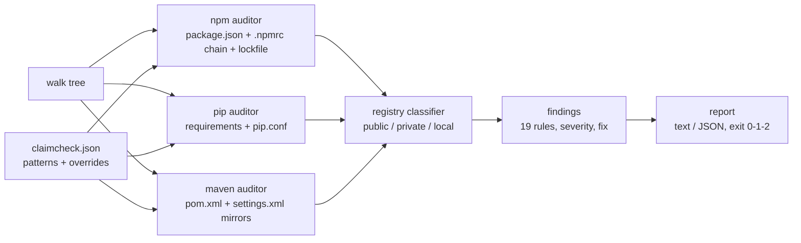

# claimcheck

[English](README.md) | [中文](README.zh.md) | [日本語](README.ja.md)

[](LICENSE)   [](CONTRIBUTING.md)

**Audits npm, pip and Maven configs for dependency-confusion exposure — unscoped internals, missing registry mappings — statically, offline, no probing.**


```bash
# not yet on npm — install from a checkout of this repository
npm install && npm run build && npm pack
npm install -g ./claimcheck-0.1.0.tgz
```

## Why claimcheck?

Five years after Alex Birsan's "Dependency Confusion" paid out six-figure bounties, the attack still works, because the root cause was never a vulnerability — it was a *configuration default*: resolvers happily ask a public registry for a name that only exists on your private one, and whoever registers that public name supplies the code. The existing tooling attacks this from the outside in: probe tools register or query the public registries to see if your internal names are claimable, which needs network access, a list of your internal names in hand, and tells you nothing about *why* you were exposed. Vulnerability scanners look for known-bad versions, not for a resolver that would accept an attacker's version. claimcheck works from the inside: it reads the files you already commit — `package.json` + the `.npmrc` chain + the lockfile, `requirements*.txt` + `pip.conf`, `pom.xml` + `settings.xml` — reproduces each resolver's actual routing decision (npm's scope-mapping precedence, pip's index pooling, Maven's mirror matching), and names every internal package whose resolution path reaches a registry where anyone can claim it. Nineteen rules, exact file citations, a fix per finding, exit 1 for CI — and not a single byte on the wire.

|  | claimcheck | confused (Visma) | dependency-combobulator | SCA scanners / update bots |
|---|---|---|---|---|
| Works fully offline | yes — reads configs, never probes | no — queries public registries | no — queries public registries | no — hosted / registry APIs |
| Finds the *config* causing exposure | yes, file + line cited | no — only that a name is free | no — only signals per package | no |
| Audits resolver routing (.npmrc / pip.conf / settings.xml) | yes, all three | no | no | no |
| Lockfile evidence of past public resolution | yes (CC-NPM-004) | no | no | no |
| Covers npm + pip + Maven in one tool | yes | yes (probe only) | partially, pluggable | varies |
| Fix guidance per finding | yes, `explain` per rule | no | no | generic |
| Runtime dependencies | 0 | Go modules | Python deps | hosted service |

<sub>Capability notes checked against each tool's public repository/documentation, 2026-07. Probe tools and claimcheck are complementary: they show a name is claimable, claimcheck shows which committed config would let a claimed name in.</sub>

## Features

- **The resolver's own logic, replayed statically** — npm's nearest-`.npmrc`-wins chain with scope precedence, pip's index-pooling (the exact `--extra-index-url` Birsan vector), Maven's `DefaultMirrorSelector` (`*`, `external:*`, comma lists, `!` exclusions) — so findings reflect what the package manager would really do.
- **19 explainable rules** — each finding carries a stable ID (`CC-NPM-001` … `CC-MVN-006`), severity, the offending file, and a one-line fix; `claimcheck explain <id>` prints the full why/fix, `claimcheck rules` lists the catalogue offline.
- **Evidence, not just theory** — lockfile checks prove when an internal name *already* resolved from a public registry, and flag privately-resolved packages your pattern list forgot.
- **Honest about unknowns** — unknown registry hosts default to private; virtual proxies that merge the public registry server-side are declared once via `publicRegistries`, because no static tool can see through them.
- **Monorepo-aware, CI-ready** — nested projects discovered automatically, `--fail-on` severity gate, per-rule/per-package `ignore` suppressions, stable `--format json`, exit codes 0/1/2.
- **Zero dependencies, byte-deterministic** — a supply-chain audit tool with a supply chain would be a punchline; in-repo XML/INI parsers keep it to zero, and identical trees produce byte-identical reports.

## Quickstart

Install (see above), then generate a starter config — claimcheck infers internal-name patterns from `.npmrc` scopes, privately-resolved lockfile entries and POM groupIds:

```bash
cd your-repo
claimcheck init      # writes claimcheck.json — review and commit it
claimcheck scan      # audit every npm/pip/Maven project under the repo
```

Against the bundled `examples/vulnerable-pip` — the classic Birsan setup:

```bash
claimcheck scan examples/vulnerable-pip
```

Output (real captured run; the per-finding `fix:` lines are omitted here):

```text
claimcheck v0.1.0 — examples/vulnerable-pip (0 npm, 1 pip, 0 maven)

pip
  CRITICAL  CC-PIP-001  --extra-index-url http://pypi.kestrel.test/simple (line 5) — pip merges all indexes and installs the best version, wherever it lives  [requirements.txt]
  HIGH      CC-PIP-002  kestrel-billing: internal requirement (line 8) while the effective index is https://pypi.org/simple  [requirements.txt]
  HIGH      CC-PIP-002  kestrel_common: internal requirement (line 9) while the effective index is https://pypi.org/simple  [requirements.txt]
  MEDIUM    CC-PIP-003  index URL uses plain http: http://pypi.kestrel.test/simple (line 5)  [requirements.txt]
  MEDIUM    CC-PIP-004  --trusted-host pypi.kestrel.test (line 3) disables TLS verification for that host  [pip.conf]
  MEDIUM    CC-PIP-005  kestrel-billing: internal requirement is not pinned to an exact version (line 8: ">=1.2")  [requirements.txt]

6 findings: 1 critical, 2 high, 3 medium, 0 low
claimcheck: FAIL — findings at or above "low"
```

Exit code 1 — wire it into CI as-is. The hardened counterpart passes clean (`claimcheck scan examples/hardened` → `0 findings`, exit 0). To understand any rule:

```text
$ claimcheck explain CC-PIP-001
CC-PIP-001 — --extra-index-url merges public and private indexes
ecosystem: pip
severity:  critical

why it matters:
  pip treats --index-url and every --extra-index-url as one pool of candidates
  and installs the best (usually highest) version wherever it lives. A public
  ...
```

## Rules

19 rules across three ecosystems; full detection conditions in [docs/rules.md](docs/rules.md).

| Ecosystem | Rules | Critical findings |
|---|---|---|
| npm | CC-NPM-001…008 | internal name routed to a public registry; lockfile proof of a past public resolution |
| pip | CC-PIP-001…005 | any `--extra-index-url` (index pooling — the original attack vector) |
| Maven | CC-MVN-001…006 | internal groupId resolvable from an effectively-public repository after mirror matching |

## Configuration

`claimcheck.json` at the scan root (start with `claimcheck init`):

| Key | Default | Effect |
|---|---|---|
| `internal` | `[]` | Glob-lite patterns naming internal packages: `"@acme/*"`, `"acme-*"`, `"com.acme.*"`. pip names are PEP 503-normalized before matching. |
| `publicRegistries` | `[]` | Hosts/URL prefixes to treat as public — declare virtual proxies that merge the public registry server-side. |
| `privateRegistries` | `[]` | Hosts/URL prefixes to force-treat as private (unknown hosts already default to private). |
| `ignore` | `[]` | Suppressions: `"CC-NPM-005"` (whole rule) or `"CC-NPM-001:legacy-cli"` (one package). |
| `failOn` | `"low"` | Minimum severity that makes the scan exit 1: `critical`, `high`, `medium`, `low`. |
| `ecosystems` | all three | Restrict to a subset of `npm`, `pip`, `maven`. |

## Verification

This repository ships no CI; every claim above is verified by local runs: `npm test` (88 node:test tests, all offline and deterministic) followed by `bash scripts/smoke.sh`, which drives the compiled CLI through all four example projects, the error paths and the init → scan → fix loop, and must print `SMOKE OK`.

## Architecture



## Roadmap

- [x] v0.1.0 — npm/pip/Maven auditors, 19 rules, effective-registry resolution, mirror semantics, lockfile evidence, config + init + explain, JSON output, 88 tests and a full smoke script.
- [ ] Yarn (`.yarnrc.yml` `npmScopes`) and pnpm (`pnpm-workspace` catalogs) routing.
- [ ] `pyproject.toml` / `Pipfile` sources and `uv`/Poetry index configuration.
- [ ] Gradle (`settings.gradle` repositories, `exclusiveContent`) alongside Maven.
- [ ] SARIF output for code-scanning upload.
- [ ] `--diff` mode: fail only on findings introduced since a committed baseline.

See the [open issues](https://github.com/JaydenCJ/claimcheck/issues) for the full list.

## Contributing

Bug reports, rule proposals and PRs are welcome — see [CONTRIBUTING.md](CONTRIBUTING.md) for the local workflow (build, 88-test suite, `SMOKE OK`). Good entry points are labelled [good first issue](https://github.com/JaydenCJ/claimcheck/issues?q=label%3A%22good+first+issue%22), and design questions live in [Discussions](https://github.com/JaydenCJ/claimcheck/discussions).

## License

[MIT](LICENSE)
