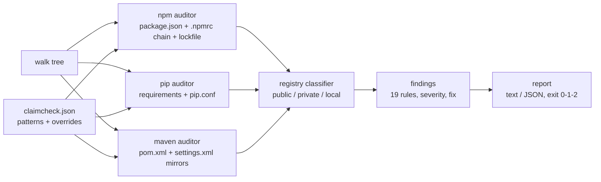

# claimcheck

[English](README.md) | [中文](README.zh.md) | [日本語](README.ja.md)

[](LICENSE)   [](CONTRIBUTING.md)

**静态审计 npm、pip 与 Maven 配置中的依赖混淆（dependency confusion）暴露面——未加 scope 的内部包、缺失的 registry 映射——完全离线，无需探测。**


```bash
# not yet on npm — install from a checkout of this repository
npm install && npm run build && npm pack
npm install -g ./claimcheck-0.1.0.tgz
```

## 为什么选择 claimcheck？

Alex Birsan 的《Dependency Confusion》拿下六位数漏洞赏金已经五年，这种攻击至今仍然有效，因为根因从来不是某个漏洞，而是一个*配置默认值*：解析器会兴冲冲地向公共 registry 询问一个只存在于你私有 registry 上的名字，谁在公共侧注册了这个名字，谁就能提供代码。现有工具都是由外向内下手：探测类工具通过注册或查询公共 registry 来确认你的内部包名是否可被抢注，这需要联网、需要事先掌握你的内部包名清单，而且完全不告诉你*为什么*会暴露。漏洞扫描器找的是已知的坏版本，而不是那个会接受攻击者版本的解析器。claimcheck 从内部出发：读取你本来就提交在仓库里的文件——`package.json` + `.npmrc` 链 + lockfile、`requirements*.txt` + `pip.conf`、`pom.xml` + `settings.xml`——复现每个解析器真实的路由决策（npm 的 scope 映射优先级、pip 的索引合并、Maven 的 mirror 匹配），并点名每一个解析路径可达"任何人都能抢注"的 registry 的内部包。19 条规则、精确到文件的引用、每条发现附修复方案、退出码 1 直接接入 CI——全程不发一个字节到网络。

|  | claimcheck | confused (Visma) | dependency-combobulator | SCA 扫描器 / 更新机器人 |
|---|---|---|---|---|
| 完全离线工作 | 是——只读配置，从不探测 | 否——查询公共 registry | 否——查询公共 registry | 否——托管服务 / registry API |
| 找出造成暴露的*配置本身* | 是，引用到文件与行号 | 否——只报名字可被抢注 | 否——只按包给出信号 | 否 |
| 审计解析器路由（.npmrc / pip.conf / settings.xml） | 是，三者全覆盖 | 否 | 否 | 否 |
| lockfile 中历史公共解析的证据 | 是（CC-NPM-004） | 否 | 否 | 否 |
| 一个工具覆盖 npm + pip + Maven | 是 | 是（仅探测） | 部分，可插拔 | 视产品而定 |
| 每条发现附修复指引 | 是，每条规则可 `explain` | 否 | 否 | 泛泛而谈 |
| 运行时依赖 | 0 | Go modules | Python 依赖 | 托管服务 |

<sub>能力说明依据各工具的公开仓库/文档核对，2026-07。探测类工具与 claimcheck 互补：前者证明名字可被抢注，claimcheck 证明是哪份已提交的配置会把被抢注的名字放进来。</sub>

## 特性

- **静态重放解析器自身的逻辑**——npm 就近 `.npmrc` 生效的配置链与 scope 优先级、pip 的索引合并（正是 Birsan 的 `--extra-index-url` 攻击向量）、Maven 的 `DefaultMirrorSelector`（`*`、`external:*`、逗号列表、`!` 排除）——发现即包管理器的真实行为。
- **19 条可解释的规则**——每条发现携带稳定 ID（`CC-NPM-001` … `CC-MVN-006`）、严重级别、出问题的文件和一行修复建议；`claimcheck explain <id>` 打印完整的缘由与修法，`claimcheck rules` 离线列出全部目录。
- **给证据，不止讲道理**——lockfile 检查能证明某个内部名字*已经*从公共 registry 解析过，并标出模式清单漏掉的、曾从私有源解析的包。
- **对未知保持诚实**——未知的 registry 主机默认按私有处理；服务端合并公共 registry 的虚拟代理通过 `publicRegistries` 声明一次即可，因为任何静态工具都看不穿它们。
- **支持 monorepo、随时接 CI**——自动发现嵌套项目，`--fail-on` 严重级别闸门，按规则/按包的 `ignore` 抑制，稳定的 `--format json`，退出码 0/1/2。
- **零依赖、字节级确定性**——一个自带供应链的供应链审计工具会沦为笑话；内置 XML/INI 解析器把依赖保持为零，相同的目录树产出逐字节相同的报告。

## 快速上手

安装（见上），然后生成起步配置——claimcheck 会从 `.npmrc` 的 scope、lockfile 中私有解析的条目以及 POM 的 groupId 推断内部包名模式：

```bash
cd your-repo
claimcheck init      # writes claimcheck.json — review and commit it
claimcheck scan      # audit every npm/pip/Maven project under the repo
```

对内置的 `examples/vulnerable-pip`——经典的 Birsan 布局——运行：

```bash
claimcheck scan examples/vulnerable-pip
```

输出（真实运行采集；每条发现附带的 `fix:` 行在此省略）：

```text
claimcheck v0.1.0 — examples/vulnerable-pip (0 npm, 1 pip, 0 maven)

pip
  CRITICAL  CC-PIP-001  --extra-index-url http://pypi.kestrel.test/simple (line 5) — pip merges all indexes and installs the best version, wherever it lives  [requirements.txt]
  HIGH      CC-PIP-002  kestrel-billing: internal requirement (line 8) while the effective index is https://pypi.org/simple  [requirements.txt]
  HIGH      CC-PIP-002  kestrel_common: internal requirement (line 9) while the effective index is https://pypi.org/simple  [requirements.txt]
  MEDIUM    CC-PIP-003  index URL uses plain http: http://pypi.kestrel.test/simple (line 5)  [requirements.txt]
  MEDIUM    CC-PIP-004  --trusted-host pypi.kestrel.test (line 3) disables TLS verification for that host  [pip.conf]
  MEDIUM    CC-PIP-005  kestrel-billing: internal requirement is not pinned to an exact version (line 8: ">=1.2")  [requirements.txt]

6 findings: 1 critical, 2 high, 3 medium, 0 low
claimcheck: FAIL — findings at or above "low"
```

退出码 1——原样接入 CI 即可。加固版的对照项目干净通过（`claimcheck scan examples/hardened` → `0 findings`，退出码 0）。想理解任何一条规则：

```text
$ claimcheck explain CC-PIP-001
CC-PIP-001 — --extra-index-url merges public and private indexes
ecosystem: pip
severity:  critical

why it matters:
  pip treats --index-url and every --extra-index-url as one pool of candidates
  and installs the best (usually highest) version wherever it lives. A public
  ...
```

## 规则

三个生态共 19 条规则；完整触发条件见 [docs/rules.md](docs/rules.md)。

| 生态 | 规则 | 严重（critical）发现 |
|---|---|---|
| npm | CC-NPM-001…008 | 内部名字被路由到公共 registry；lockfile 中历史公共解析的实证 |
| pip | CC-PIP-001…005 | 任何 `--extra-index-url`（索引合并——原始攻击向量） |
| Maven | CC-MVN-001…006 | mirror 匹配后，内部 groupId 仍可从实际公开的仓库解析 |

## 配置

扫描根目录下的 `claimcheck.json`（可用 `claimcheck init` 起步）：

| 键 | 默认值 | 作用 |
|---|---|---|
| `internal` | `[]` | 命名内部包的简化 glob 模式：`"@acme/*"`、`"acme-*"`、`"com.acme.*"`。pip 名称匹配前会做 PEP 503 归一化。 |
| `publicRegistries` | `[]` | 按公共对待的主机/URL 前缀——用于声明在服务端合并公共 registry 的虚拟代理。 |
| `privateRegistries` | `[]` | 强制按私有对待的主机/URL 前缀（未知主机本就默认私有）。 |
| `ignore` | `[]` | 抑制项：`"CC-NPM-005"`（整条规则）或 `"CC-NPM-001:legacy-cli"`（单个包）。 |
| `failOn` | `"low"` | 使扫描以退出码 1 失败的最低严重级别：`critical`、`high`、`medium`、`low`。 |
| `ecosystems` | 全部三个 | 限定为 `npm`、`pip`、`maven` 的子集。 |

## 验证

本仓库不附带任何 CI；上述每一条主张都由本地运行验证：`npm test`（88 个 node:test 测试，全部离线且确定性）之后运行 `bash scripts/smoke.sh`，它驱动编译后的 CLI 走完全部四个示例项目、错误路径和 init → scan → fix 闭环，必须打印 `SMOKE OK`。

## 架构



## 路线图

- [x] v0.1.0——npm/pip/Maven 审计器、19 条规则、有效 registry 解析、mirror 语义、lockfile 实证、config + init + explain、JSON 输出、88 个测试与完整冒烟脚本。
- [ ] Yarn（`.yarnrc.yml` 的 `npmScopes`）与 pnpm（`pnpm-workspace` catalogs）路由。
- [ ] `pyproject.toml` / `Pipfile` 来源与 `uv`/Poetry 的索引配置。
- [ ] 在 Maven 之外支持 Gradle（`settings.gradle` 仓库、`exclusiveContent`）。
- [ ] 面向 code-scanning 上传的 SARIF 输出。
- [ ] `--diff` 模式：只对相对已提交基线新增的发现报错。

完整列表见 [open issues](https://github.com/JaydenCJ/claimcheck/issues)。

## 参与贡献

欢迎缺陷报告、规则提案与 PR——本地流程（构建、88 个测试、`SMOKE OK`）见 [CONTRIBUTING.md](CONTRIBUTING.md)。入门任务标注为 [good first issue](https://github.com/JaydenCJ/claimcheck/issues?q=label%3A%22good+first+issue%22)，设计讨论在 [Discussions](https://github.com/JaydenCJ/claimcheck/discussions)。

## 许可证

[MIT](LICENSE)
